# Unified Dashboard Architecture Diagrams

## System Architecture Overview

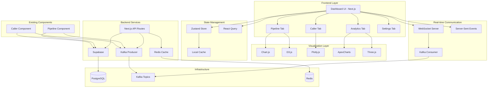

## Component Architecture

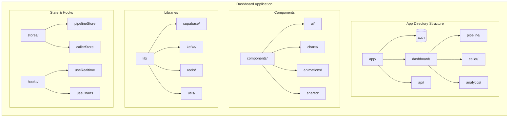

## Data Flow Architecture

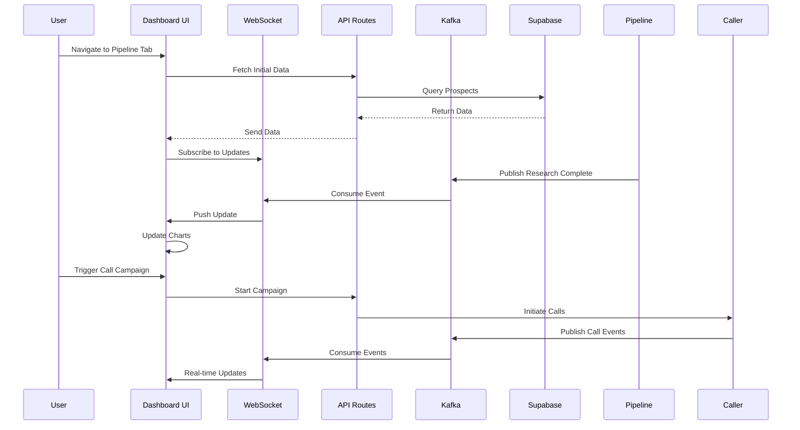

## Pipeline Tab Architecture

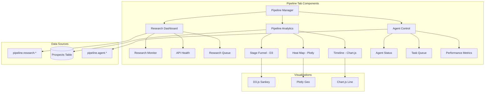

## Caller Tab Architecture

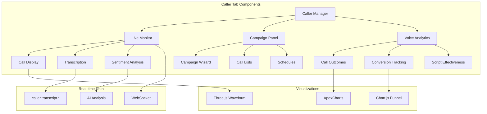

## Database Schema

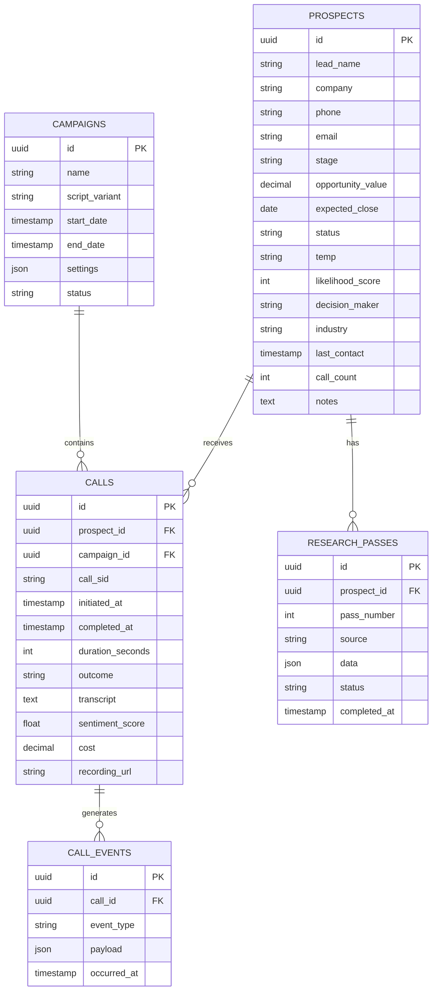

## Kafka Topic Architecture

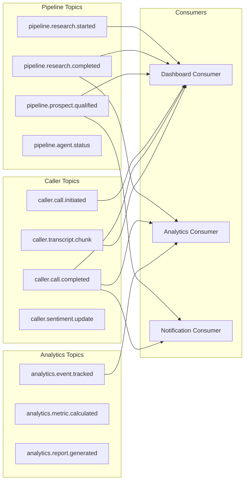

## Animation & Interaction Flow

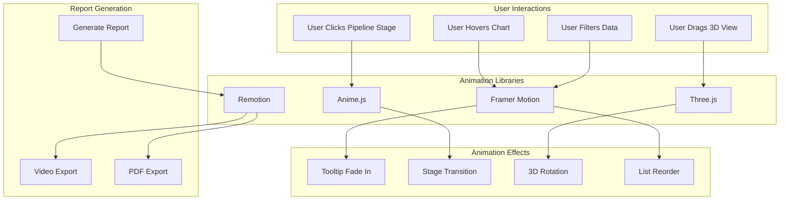

## Deployment Architecture

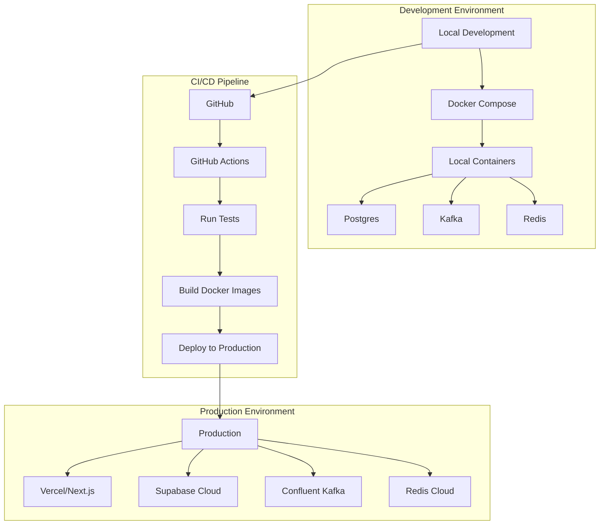

## Security Architecture

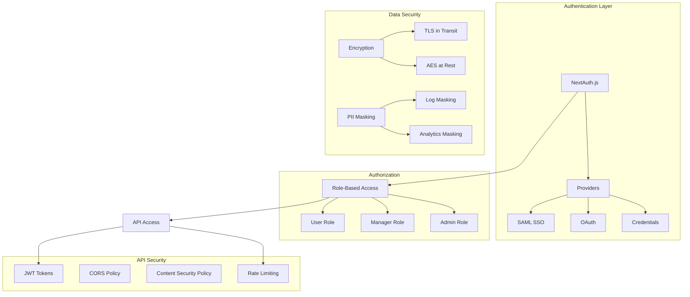

## Performance Optimization Strategy

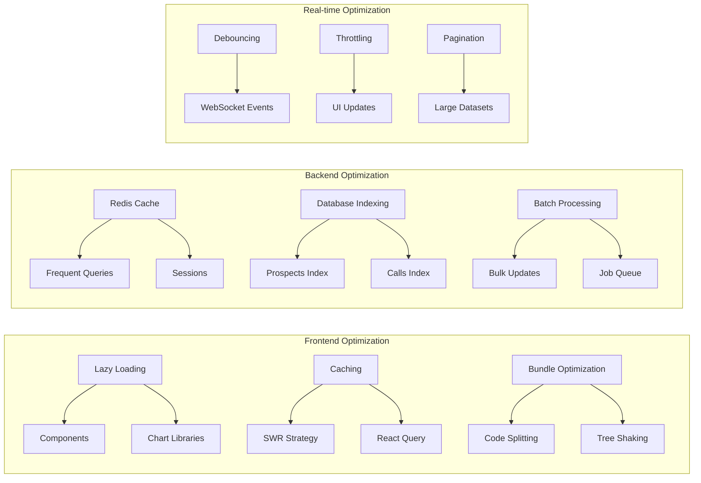

---

**Note**: These diagrams represent the complete architecture of the Unified Sales Dashboard. Each component is designed for scalability, maintainability, and optimal performance. The architecture supports both real-time updates and offline capabilities through strategic caching and local-first design patterns.