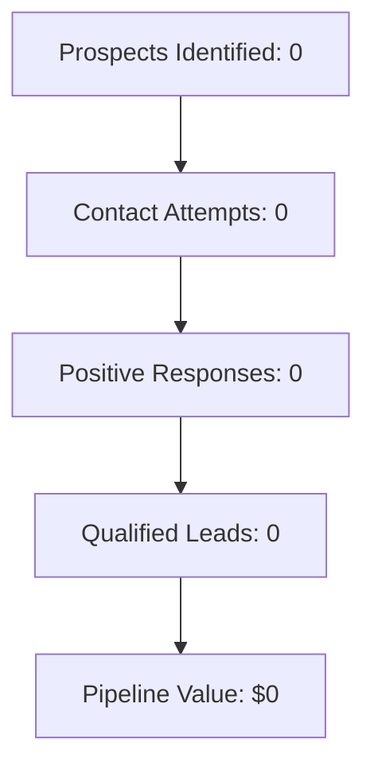

# Sales Automation Dashboard

## 🎯 Daily Sales Overview

**Today:** {{date:YYYY-MM-DD}}  
**Status:** 🟢 System Active  
**Last Updated:** {{date:HH:mm}}

---

## 📊 Key Performance Indicators

### Today's Metrics
```dataview
TABLE
    count(rows) as "Count"
FROM "Projects/Sales/Activities"
WHERE date(date) = date(today)
GROUP BY activity_type as "Activity Type"
```

### Pipeline Overview
```dataview
TABLE
    count(rows) as "Count",
    round(avg(qualification_score)) as "Avg Score"
FROM "Projects/Sales/Prospects"  
GROUP BY pipeline_stage as "Stage"
SORT pipeline_stage
```

---

## 🔥 Today's Priorities

### High-Priority Follow-ups
```dataview
TABLE
    prospect as "Company",
    follow_up_type as "Type",
    follow_up_date as "Due Date"
FROM "Projects/Sales/Activities"
WHERE follow_up_required = true 
    AND date(follow_up_date) <= date(today)
SORT follow_up_date ASC
LIMIT 10
```

### Hot Prospects (Score 80+)
```dataview
TABLE
    company as "Company",
    qualification_score as "Score",
    pipeline_stage as "Stage",
    updated as "Last Activity"
FROM "Projects/Sales/Prospects"
WHERE qualification_score >= 80
SORT qualification_score DESC
LIMIT 10
```

---

## 📈 Campaign Performance

### Active Campaigns
```dataview  
TABLE
    campaign_name as "Campaign",
    prospects_identified as "Prospects",
    contact_attempts as "Contacts", 
    qualified_leads as "Qualified",
    response_rate as "Response %"
FROM "Projects/Sales/Campaigns"
WHERE status = "active"
SORT response_rate DESC
```

### This Week's Progress
```dataview
TABLE
    count(rows) as "Activities"
FROM "Projects/Sales/Activities"
WHERE date(date) >= date(today) - dur(7 days)
GROUP BY dateformat(date, "yyyy-MM-dd") as "Date"
SORT Date DESC
```

---

## 🎛️ Agent Status & Controls

### Agent Performance Today
| Agent | Activities | Success Rate | Status |
|-------|------------|-------------|--------|
| Prospecting Agent | {{DATE:activities_prospecting}} | {{DATE:success_prospecting}}% | 🟢 Active |
| Pitch Creator Agent | {{DATE:activities_pitch}} | {{DATE:success_pitch}}% | 🟢 Active |
| Voice AI Agent | {{DATE:activities_voice}} | {{DATE:success_voice}}% | 🟢 Active |
| Email Agent | {{DATE:activities_email}} | {{DATE:success_email}}% | 🟢 Active |

### Quick Actions
```button
name Start New Campaign
type command
action QuickAdd: Sales Campaign
customColor #28a745
customTextColor #fff
```

```button
name Add New Prospect
type command  
action QuickAdd: Sales Prospect
customColor #007bff
customTextColor #fff
```

```button
name Review Activities
type link
action obsidian://open?vault=Main&file=Projects%2FSales%2FActivities
customColor #6c757d
customTextColor #fff
```

---

## 📋 Recent Activities (Last 24 Hours)

```dataview
TABLE
    prospect as "Company",
    activity_type as "Activity",
    outcome as "Outcome", 
    agent_responsible as "Agent",
    dateformat(date, "HH:mm") as "Time"
FROM "Projects/Sales/Activities"
WHERE date(date) >= date(today) - dur(1 day)
SORT date DESC
LIMIT 15
```

---

## 🚨 Alerts & Reviews Required

### Human Review Required
```dataview
TABLE 
    prospect as "Company",
    activity_type as "Activity",
    date as "Date",
    human_review_required as "Review Status"
FROM "Projects/Sales/Activities"
WHERE human_review_required = true AND human_review_completed = false
SORT date DESC
LIMIT 10
```

### System Alerts
- [ ] No system alerts at this time

---

## 📊 Weekly Performance Summary

### Conversion Funnel (This Week)


### Weekly Goals vs Actual
| Metric | Goal | Actual | Progress |
|--------|------|--------|----------|
| New Prospects | 50 | 0 | 0% |
| Contact Attempts | 75 | 0 | 0% |
| Qualified Leads | 5 | 0 | 0% |
| Pipeline Value | $15,000 | $0 | 0% |

---

## 🎯 Pipeline Management

### Prospects by Stage
```dataview
TABLE
    company as "Company",
    qualification_score as "Score",
    updated as "Last Updated"
FROM "Projects/Sales/Prospects"
WHERE pipeline_stage = "cold"
SORT qualification_score DESC
LIMIT 5
```

### Follow-up Queue
```dataview
TABLE
    prospect as "Company", 
    follow_up_type as "Type",
    follow_up_date as "Due Date",
    datediff(follow_up_date, date(today), "day") as "Days"
FROM "Projects/Sales/Activities"
WHERE follow_up_required = true
SORT follow_up_date ASC
LIMIT 10
```

---

## 🔧 System Health & Monitoring

### API Status
- **Anthropic Claude API:** 🟢 Connected
- **Google Maps API:** 🟢 Connected  
- **Email Service:** 🟢 Connected
- **Voice Service:** 🟢 Connected

### Recent System Events
*No recent events to report*

### Performance Optimization Opportunities
*System is operating efficiently*

---

## 📁 Quick Navigation

### Frequently Used
- [[Projects/Sales/Prospects|All Prospects]]
- [[Projects/Sales/Campaigns|All Campaigns]]  
- [[Projects/Sales/Activities|All Activities]]
- [[Resources/General/Templates/Sales/Prospect-Profile|Prospect Template]]

### Daily Tasks Integration
*This dashboard is linked to your daily note template for seamless workflow integration*

---

## 📝 Notes & Ideas

### Strategic Notes
*Add strategic observations about market trends, competition, or optimization opportunities*

### Improvement Ideas
- [ ] Consider A/B testing different call scripts
- [ ] Analyze response rates by industry vertical
- [ ] Optimize qualification scoring algorithm
- [ ] Develop industry-specific messaging

---

*Dashboard last updated: {{date:YYYY-MM-DD HH:mm}} - Refresh this page for current data*